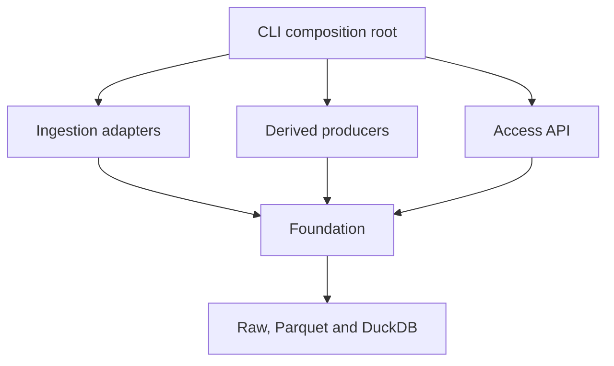

# Architecture

## Purpose and invariants

This store is the canonical data boundary for research code. Analysis projects
know dataset identifiers, entity identifiers, variables and time ranges; they
never know filesystem paths. The store preserves publisher bytes, semantic
conventions, snapshot identity and transitive provenance.

An observation may describe an instant or an interval. This distinction matters
for hourly accumulations and daily statistics, especially across daylight-saving
time changes. Every time-series dataset therefore declares its temporal kind,
native frequency, source timezone and timestamp labelling convention.

## Layers and dependency rule



The foundation owns configuration, the registry, schemas, conventions,
partitioning, hashing, the catalogue, checkpoints and the only Parquet writer.
An ingester parses one external format and emits canonical Arrow chunks. A
derived producer emits the same chunks but records parent snapshots and its
query. The access layer reads committed catalogue entries only.

`tests/test_architecture.py` parses the Python syntax tree and fails when:

- the foundation imports access, ingestion or derived code;
- an ingestion module imports another ingestion module or the access layer;
- a dataset is declared outside `foundation/registry.py`; or
- Parquet is written outside `foundation/writer.py`.

The CLI is the composition root and is the only layer allowed to import the
independent application layers together.

## On-disk layout

```text
$RESEARCH_DATA_ROOT/
├── raw/
│   ├── objects/sha256/<prefix>/<digest>
│   └── source-manifests/<digest>.json
├── warehouse/
│   ├── external/<dataset>/snapshots/<snapshot>/...
│   └── derived/<dataset>/snapshots/<snapshot>/...
├── staging/runs/<run>/fragments/...
├── catalog/store.duckdb
└── locks/
```

`raw` and `catalog` are durable backup material. `warehouse` and `staging` are
rebuildable. Raw objects are addressed by SHA-256 and made read-only on
filesystems that support it. Original filenames, URI, download time and
publisher vintage remain in `source_aliases`; they are not used as identity.

The environment variable is `RESEARCH_DATA_ROOT`. The fallback chain is:

1. an explicit `store=` argument or CLI `--store` option;
2. `RESEARCH_DATA_ROOT`;
3. the operating system's per-user application-data directory.

Writes warn when the fallback is used. All resolutions warn for common
cloud-synchronization directory names.

## Physical and logical observations

The registry permits two physical representations:

- **long**, for sparse element/value sources; and
- **wide**, for synchronized dense sources such as turbine SCADA.

`load()` exposes one logical form: entity and interval keys followed by
variable-named columns. Different quantities never share a generic `value`
column in the returned dataframe. This gives SCADA its efficient natural form
without making analysis code learn a second API. Long Parquet is pivoted only
after entity, time and variable filtering.

Every variable has one quantity, unit, Arrow type and optional quality field in
the registry. Numeric research values remain float64. Entity identifiers must
already be strings; numeric autocasting is rejected.

## Relational model

DuckDB holds the small relational catalogue. Parquet observations reference it
with stable identifiers.

| Relationship | Purpose |
|---|---|
| `variables.dataset_id → datasets.dataset_id` | One canonical schema declaration |
| `source_aliases.source_id → source_files.source_id` | Names and vintages for immutable bytes |
| `ingestion_runs.dataset_id/source_id` | Idempotency is dataset plus source, not hash alone |
| `fragments.snapshot_id/source_id` | Exact files and sources behind a result |
| `derivation_edges.child → parent` | Transitive provenance for derived tables |
| `snapshot_parents.child → parent` | Cumulative append snapshots |
| `entity_match_candidates` | Cross-source matches plus evidence and decision state |

The large Parquet relations cannot have database-enforced foreign keys. The
foundation writer instead validates their schema and injects catalogue-owned
source and producer-run identifiers before publication. SQL clients attach the
catalogue read-only and expose only logical dataset views.

## Idempotency, checkpoints and publication

An external run is uniquely identified by:

```text
(dataset_id, source_sha256, ingester_version, registry_hash)
```

A derived run uses the dataset, ordered parent snapshots, query, producer
version and registry hash. Each output chunk has a deterministic key and a
catalogue checkpoint. Restarting retains completed chunks.

All fragments for a run are written below one staging directory. Publication:

1. validates every fragment and duplicate key across the complete logical
   snapshot;
2. atomically renames the staging fragment directory into its final snapshot;
3. commits fragment rows, lineage and snapshot state in one DuckDB transaction.

A crash before step 2 leaves restartable staging. A crash between steps 2 and 3
leaves an unreferenced directory that readers cannot see; rerunning completes
the catalogue transaction. Readers never glob staging or arbitrary output
directories.

Append datasets inherit the preceding committed fragment manifest. Replacement
datasets, such as a refreshed whole-archive delivery, create an independent
snapshot. Old snapshots remain queryable by ID.

## Partitioning and query cost

Time series are partitioned by UTC year and a stable BLAKE2 entity bucket. Rows
are sorted and Parquet statistics are enabled. `load()` computes the relevant
year and bucket before asking the catalogue for fragment paths, so a query for
one entity and one year does not open unrelated Parquet files. It then projects
only requested variable columns.

For `B` reasonably balanced buckets, the candidate row population is expected
to be approximately one `year/B` slice, but this is not a performance claim.
Actual skew, compressed bytes and elapsed time must be measured after sample
ingestion:

```bash
research-store benchmark DATASET --entity ENTITY --year 2024 --variable VARIABLE
```

The command reports candidate fragment count, compressed bytes, result rows and
wall time. Bucket counts and row-group sizes must be changed only using those
measurements. No size or timing estimate has been invented from filenames.

## Silent-failure controls

| Failure | Control |
|---|---|
| Different quantities in one value column | Logical output uses separately named variable columns and registered units |
| Numeric sentinels | Source adapter applies registered rules before Arrow conversion |
| Sentinel meaning changes | Inclusive-start/exclusive-end era rules; overlaps and uncovered eras fail |
| Numeric-looking identifiers | String schema required before publication |
| 30 February after unpivot | Calendar arithmetic drops impossible day slots; invalid year/month raises |
| Longitude conventions | Explicit conversion to signed EPSG:4326; unknown convention raises |
| Local/DST/UTC confusion | Source timezone and labelling required; ambiguous/nonexistent clocks raise |
| Different sampling frequencies | Native frequency remains registry metadata; no ingestion resampling |
| float64 narrowed to float32 | Writer schema validation rejects float32 |
| Cloud-synchronized root | Resolver and `doctor` warn |
| Empty/partial producer output | Empty chunks fail and only committed catalogue fragments are readable |
| Duplicate observations | Keys are checked within chunks and across the full published snapshot |

## Decisions deliberately unresolved

The initial source entries are `provisional`; ingestion is blocked until real
samples and publisher documentation settle offsets, units, time semantics,
quality codes and sentinel rules. The store also does not decide which
overlapping instrument is the analysis series, whether cross-source entities
are identical, or whether a grid is sampled at a point or aggregated over an
area. Candidate relationships and evidence belong in the store; acceptance is
an explicit research decision.

