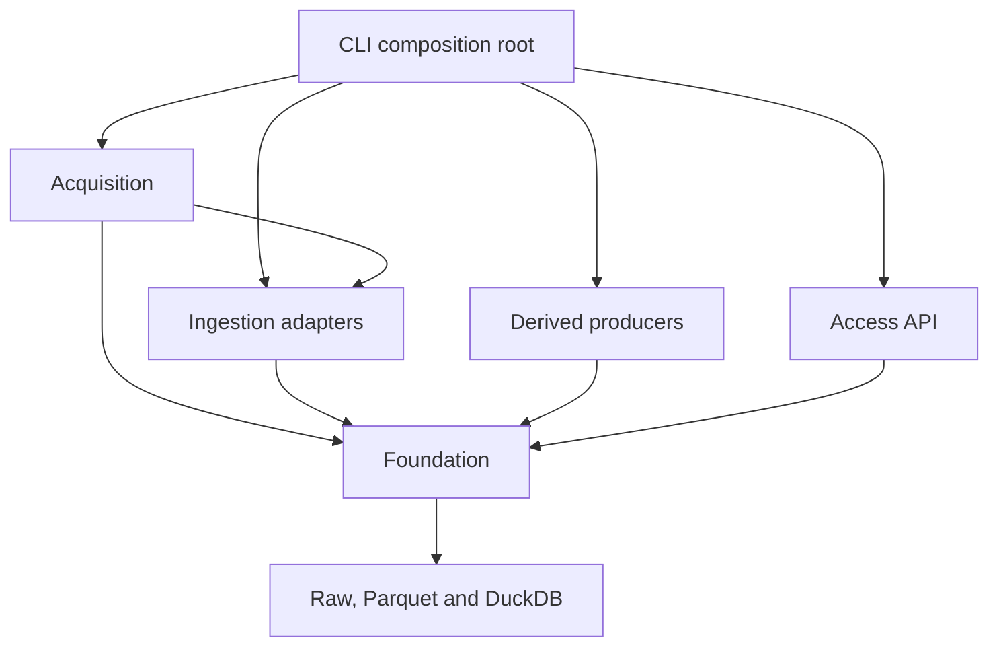

# Architecture

## Purpose and invariants

This store is the canonical data boundary for research code. Analysis projects
know dataset identifiers, entity identifiers, variables and time ranges; they
never know filesystem paths. The store preserves publisher bytes, semantic
conventions, snapshot identity and transitive provenance.

An observation may describe an instant or an interval. This distinction matters
for hourly accumulations and daily statistics, especially across daylight-saving
time changes. Every time-series dataset therefore declares its temporal kind,
native frequency, source timezone and timestamp labelling convention.

## Layers and dependency rule


```mermaid
flowchart TD
    CLI[CLI composition root] --> ACQ[Acquisition]
    CLI --> ING[Ingestion adapters]
    CLI --> DER[Derived producers]
    CLI --> API[Access API]
    ACQ --> ING
    ACQ --> FND
    ING --> FND[Foundation]
    DER --> FND
    API --> FND
    FND --> STORE[Raw, Parquet and DuckDB]
```

The foundation owns configuration, the public registry, private overlay
resolution, schemas, conventions, partitioning, hashing, the catalogue,
checkpoints and the only Parquet writer.
An ingester parses one external format and emits canonical Arrow chunks. A
derived producer emits the same chunks but records parent snapshots and its
query. The access layer reads committed catalogue entries only. An acquisition
module downloads a publisher API's responses into `downloads/` and writes a
selection manifest in the format its ingestion module declares; it never
touches the catalogue.

`tests/test_architecture.py` parses the Python syntax tree and fails when:

- the foundation imports access, acquisition, ingestion or derived code;
- an ingestion module imports another ingestion module, acquisition or the
  access layer;
- an acquisition module imports anything of the store but foundation and
  ingestion, or anything but the CLI imports acquisition;
- a public dataset is declared outside `foundation/registry.py`;
- Parquet is written outside `foundation/writer.py`; or
- any module outside `acquisition/` imports a network client
  (`urllib.request`, `http.client`, `socket`, `requests`, `httpx`, `urllib3`).

### Acquisition is separate from ingestion

Most sources arrive as delivered files. A source that the store downloads from
a publisher API is acquired in a separate step, `research-store fetch`, which
runs the `acquisition` layer and writes only the `downloads/<dataset>/` cache:
every response body under its content digest, and a selection manifest naming
each response with its request URL, retrieval time, HTTP date, server and
SHA-256. Ingestion then reads the manifest offline. It never opens a socket, it
archives the manifest and every response in `raw/` exactly as they were
received, and it resolves a member from `raw/` when the cache is gone, so
`reingest` and a restore replay the same bytes. The ingestion module owns the
declared query and the manifest format, and the acquisition module imports
them from it; only the acquisition layer may import a network client.

The CLI is the composition root and is the only layer allowed to import the
independent application layers together.

## On-disk layout

```text
ResearchDataStore/
├── raw/
│   ├── objects/sha256/<prefix>/<digest>
│   └── source-manifests/<digest>.json
├── warehouse/
│   ├── external/<dataset>/data/<partition>/part-<content-digest>.parquet
│   └── derived/<dataset>/data/<partition>/part-<content-digest>.parquet
├── staging/runs/<run>/part-<chunk-digest>.parquet
├── catalog/store.duckdb
├── locks/write.lock
└── downloads/                      (never catalogued)
    ├── <delivery>/...                delivered publisher downloads
    └── <dataset>/                    a `fetch` cache, e.g. eccc_climate_hourly_observations
        ├── <retrieved>_<digest>.tsv  selection manifests
        ├── pages/<station>/...       publisher responses by content digest
        ├── cache-index.tsv
        └── fetch-log.jsonl
```

`downloads/` is never catalogued, and `doctor` and `gc` ignore it, but it is
not uniformly disposable. It holds delivered publisher downloads, which
ingestion reports cite in their reproduction commands and which should be
kept, beside the caches `research-store fetch` writes for an API-acquired
dataset. Only such a fetch cache, `downloads/<dataset>/`, is rebuildable: its
ingest archives every byte it read into `raw/`, so it may be deleted once its
manifests have been ingested.

**A fragment belongs to a dataset, not to a snapshot.** A snapshot is a
catalogue manifest naming fragments; it has no directory. This is deliberate.
An earlier layout filed fragments under `snapshots/<snapshot>/`, which made an
append snapshot look self-contained when it was not: because appends inherit
their parent's manifest, one snapshot's rows were spread across every directory
that had ever contributed to it, and deleting an "old" snapshot directory would
have destroyed most of the live dataset. Nothing on disk now invites that.

Fragments are named by their own content digest, so re-deriving identical bytes
reproduces the identical path. That is what allows a rebuild to land exactly
where the catalogue already points.

Catalogue fragment paths are **relative to the store root**. The store can be
moved, restored to a different path, or copied to another machine, and still
resolve. `research-store doctor` fails if any absolute path remains.

Raw objects are addressed by SHA-256 and made read-only on filesystems that
support it, as are published fragments. Original filenames, URI, download time
and publisher vintage remain in `source_aliases`; they are not used as identity.

### What to back up, and how a restore works

`raw` and `catalog` are the durable material; `warehouse` and `staging` are
rebuildable from them. A restore is:

1. put `raw/` and `catalog/` back, at any path;
2. re-run `research-store ingest` for each archived source.

An ingest whose run is already committed checks that the fragments that run
produced are actually present. If they are, it returns immediately. If they are
gone, it rebuilds them **into the same snapshot**, rather than minting a new
snapshot identity that the restored catalogue could never match. Only that
property makes the two backed-up directories sufficient. The rebuilt snapshot
keeps its original commit time (and a supersession), so rebuilding an older
replacement snapshot never makes it the live one.

The default is the Git-ignored `ResearchDataStore/` directory at the repository
root. The resolution chain is:

1. an explicit `store=` argument or CLI `--store` option;
2. `RESEARCH_DATA_ROOT`;
3. the repository-local `ResearchDataStore/` directory.

All resolutions warn for common cloud-synchronization directory names.

## Physical and logical observations

The registry permits two physical representations:

- **long**, for sparse element/value sources; and
- **wide**, for synchronized dense sources such as turbine SCADA.

`load()` exposes one logical form: entity and interval keys followed by
variable-named columns. Different quantities never share a generic `value`
column in the returned dataframe. This gives SCADA its efficient natural form
without making analysis code learn a second API. Long Parquet is pivoted only
after entity, time and variable filtering.

Every variable has one quantity, unit, Arrow type and optional quality field in
the registry. Numeric research values remain float64. Entity identifiers must
already be strings; numeric autocasting is rejected.
Wide observations may also declare non-measurement annotations. These fields
are type-checked and returned with the requested variables, but they are not
misrepresented as physical quantities. Corrected hydrometric unit values use
this mechanism for AQUARIUS Approval Level, Grade and Qualifiers.
The qualifier annotation is a JSON string array so a variadic publisher row
does not lose or concatenate distinct qualifier labels.

## Relational model

DuckDB holds the small relational catalogue. Parquet observations reference it
with stable identifiers.

| Relationship | Purpose |
|---|---|
| `variables.dataset_id → datasets.dataset_id` | One canonical schema declaration |
| `source_aliases.source_id → source_files.source_id` | Names and vintages for immutable bytes |
| `ingestion_runs.dataset_id/source_id` | Idempotency is dataset plus source, not hash alone |
| `ingestion_inputs.run_id/source_id` | Collection manifests, selection metadata and member sources plus run parameters |
| `ingestion_rejections.run_id/source_id` | Auditable source locators for quarantined or partially recovered records |
| `fragments.snapshot_id/source_id` | Exact files and sources behind a result |
| `derivation_edges.child → parent` | Transitive provenance for derived tables |
| `snapshot_parents.child → parent` | Cumulative append snapshots |
| `entity_match_candidates` | Cross-source matches plus evidence and decision state |

The large Parquet relations cannot have database-enforced foreign keys. The
foundation writer instead validates their schema and injects catalogue-owned
source and producer-run identifiers before publication. SQL clients attach the
catalogue read-only and expose only logical dataset views.

Climate observations and `eccc_station_inventory` deliberately use the same
string `entity_id`: the ECCC Climate ID. Numeric and alphanumeric values are
both preserved, so an observation can be joined directly to its station
metadata.

ECCC HLY products are source-specific datasets rather than anonymous weather
families. `eccc_hly01_observations` is long-form and supports multiple registered
elements with per-element scale, unit and interval placement. This allows the
same relation to hold hourly precipitation, quarter-hour precipitation, gauge
weight, near-gauge wind and snow depth without losing the publisher element
code. Additional HLY01 variables such as temperature can be registered without
creating another physical model. `eccc_hly03_observations` remains separate
because its source product and timestamp semantics differ.

Malformed-source handling is dataset policy, not a global parser relaxation.
HLY03 may recover complete, structurally valid 186-character records embedded
in a malformed physical line; the line hash, source locator, discarded length,
and recovery count are committed to `ingestion_rejections`. HLY01 continues to
fail on malformed structure. Records whose station timezone cannot be supported
are also quarantined there, because a raw local-standard-time record cannot be
placed on the UTC timeline without a defensible station location.
The same rule applies to the rare daily record that spans a historical change
in standard UTC offset and therefore contains a skipped or repeated civil hour.

`hydrometric_discharge_unit_corrected` is a replacement-snapshot collection
dataset. Its publisher manifest, the HYDAT station table used for selection and
every selected compressed station file are immutable ingestion inputs. The
canonical timestamp is the publisher's explicit UTC instant and native cadence
is left unset because cadence varies. A gross-drainage-area ceiling can select a
working subset, but the threshold and selected area values are recorded with
the run rather than embedded in the dataset identifier or registry declaration.

`eccc_climate_hourly_observations` is the public hourly climate product from
the MSC GeoMet `climate-hourly` API. Each source row is one synchronized
station-hour carrying many quantities, so it is wide: numeric variables with a
quality field per variable sourced from the publisher's `*_FLAG` columns, a
string variable for the present-weather text, and annotations for the
publisher's `STN_ID` and record-level `FLAG`. It shares the Climate ID
`entity_id` and the station-inventory timezone rules with the HLY datasets
(the rules live once in `foundation/station_time.py`). `LOCAL_DATE` H is the
observation time, and the hourly precipitation total is for the hour ending
then, so each row is keyed by `[H-1h, H)` LST and every other variable sits at
the slot's end; the registry declares each variable's placement
(`variable_timing`). H is on the half hour at UTC-3:30 (Newfoundland)
stations. The publisher's own `UTC_DATE` is cross-checked against the converted
observation time, `time_end`, and a disagreeing record is quarantined. Wind
direction arrives in tens of degrees; each raw value must be an integer from 0
to 36, it is stored in degrees true with the scale declared in the registry,
and the calm `0` has no direction (null). A missing-value marker applies only
to the fields its evidence covers (`sentinel_variables`): `NA` in a numeric
field stops ingestion instead of becoming null.

The dataset is a replacement collection: the selection manifest written by
`fetch` is the run's source, and every response is an ingestion input with a
role (`selection_manifest`, `observation_source`, `completeness_evidence`). A
replacement that would hide hours readers can currently see, the `LOCAL_DATE`
range each published window actually held, is refused unless
`--allow-selection-shrink` is given. `reingest` replays manifests oldest first
and does not measure one that was published before against the newer snapshot
it precedes; one that was refused is refused again. A window retrieved less
than the registry's `settle_days` after it ended can still gain hours, so
`fetch` asks for it again rather than reusing its cache, and the run records
whether each window was settled.

`eccc_dly04_observations` is the daily counterpart and is long-form for the same
reason. Its climatological day is a fixed UTC boundary rather than a
station-local one, so it shares the Climate ID `entity_id` with the station
inventory without depending on it for timestamps. The boundary is declared as
inclusive-start, exclusive-end era rules in the same shape as the sentinel rules,
and an uncovered era fails: the pre-1961 archive closed the maximum- and
minimum-temperature days at different hours, and non-hourly stations closed
theirs at station-specific observation times, so neither can inherit the modern
0600Z convention silently.

The timezone polygon data package is pinned. Its installed version is stored in
each station row, so a future boundary-data update is an explicit ingester and
registry change rather than a silent reinterpretation of historical timestamps.

## Public and private source configuration

Public publisher formats and canonical meanings are declared in
`foundation/registry.py`. Licensed source column names and other protected
metadata must not enter Git history. `RESEARCH_STORE_PRIVATE_REGISTRY` may point
to a JSON overlay outside the repository. An overlay may refine an existing
dataset's variables, units, source timezone, timestamp semantics and ingestion
options; it cannot invent a new public dataset identifier.

The resolved private values participate in `registry_hash`. Consequently, a
mapping or unit change creates a different ingestion identity even when the raw
file is unchanged. The resolved JSON is recorded only in the local DuckDB
catalogue. The private overlay must be backed up with the catalogue but never
committed to a public repository.

## Documentation metadata and ingestion reports

`DatasetSpec.documentation` records the source format, authoritative references,
QC interpretation, source flag meanings and instrument limitations. It is
serialized into the local catalogue so data users can inspect it with the
dataset declaration. It is deliberately excluded from `registry_hash`: adding a
citation or clarifying a publisher's QC statement cannot change parsed rows or
create a duplicate append identity. Transformative declarations such as scale,
unit, sentinel, element mapping and timestamp placement remain in the identity.

The [production ingestion protocol](ingestion-protocol.md) requires a dated,
version-controlled report after each production batch. The report links source
scope, execution identities, snapshots, exact record reconciliation, rejection
counts and data-quality limitations without committing raw data or workstation
paths. Repository tests enforce the required report sections.

## Idempotency, checkpoints and publication

An ordinary external run is uniquely identified by:

```text
(dataset_id, source_sha256, ingester_version, dataset_identity_digest)
```

The last term is the digest of **that dataset's own** declaration, not of the
whole registry. A whole-registry digest is still recorded on every run for
provenance, but it must not decide whether an ingest has already happened:
declaring or editing an unrelated dataset would then invalidate every finished
run in the store, and re-running a completed ingest would no longer be a no-op.

For a collection, the ingester version is extended with a deterministic
selection fingerprint covering the manifest, selection-metadata source, run
parameters and selected member hashes. The same collection is idempotent, while
changing or removing a selection filter creates a distinct replacement snapshot.

A derived run uses the dataset, ordered parent snapshots, query, producer
version and registry hash. Each output chunk has a deterministic key and a
catalogue checkpoint. Restarting retains completed chunks.

All fragments for a run are written below one staging directory. Publication:

1. checks each declared plausibility band against the distribution about to be
   published;
2. validates duplicate keys across the complete logical snapshot;
3. moves each fragment to its content-addressed place in the dataset's `data`
   directory;
4. commits fragment rows, lineage and snapshot state in one DuckDB transaction.

Nothing is referenced until step 4, so a crash at any earlier point is safe: a
crash before step 3 leaves restartable staging, and a crash between steps 3 and
4 leaves unreferenced files that no reader can see and `research-store gc`
reclaims. Readers never glob staging or arbitrary output directories.

A run that fails keeps its staging so it can resume without re-writing
completed chunks. `doctor` reports staging that belongs to no running run, and
`gc` reclaims it.

Append datasets inherit the preceding committed fragment manifest. Replacement
datasets, such as a refreshed whole-archive delivery, create an independent
snapshot. Old snapshots remain queryable by ID.

### Which code wrote a run

Every time a run starts writing (when it starts, when a failed or interrupted
run resumes, and when a committed run is rebuilt) the writer records the git
commit of the installed `research_store` package in `run_code_versions`. The
record also lists any path in the package or `pyproject.toml` that differs from
that commit. The commit is a record, not part of run identity, so a new commit
never re-keys a finished run or turns a re-ingest into new work.

A writer refuses to open when that code is not exactly a commit: uncommitted
edits, untracked modules, or an installation that is not a git checkout. The
refusal happens before any source is archived, so it leaves nothing behind.
`--allow-uncommitted-code`, or `RESEARCH_STORE_ALLOW_UNCOMMITTED_CODE=1`, lifts
the refusal for development and scratch stores, and the uncommitted paths are
then recorded with each run. `research-store provenance DATASET --code` follows
a snapshot's fragments back to every run that wrote them, so an append snapshot
reports the code of each run it inherited, not only its own.

### Correcting published data

An append cannot fix a value that was wrong when it was published; it would sit
beside the wrong rows or collide with them. `research-store supersede DATASET
--reason ...` marks every committed snapshot of a dataset superseded, with the
reason recorded. Superseded snapshots stop being readable and stop being
inherited by the next append, but they stay in the catalogue and keep their
fragments, so the record of what was once published survives. A corrected
re-ingest then starts a clean lineage.

## Verification and maintenance

The catalogue records a SHA-256 for every archived source and every published
fragment. Recording evidence is not the same as checking it:

| Command | What it does |
|---|---|
| `research-store doctor` | Missing fragments, absolute paths, legacy layout, abandoned staging, runs stuck running, runs written from uncommitted code, retired datasets, unreferenced files, declared-but-empty datasets |
| `research-store doctor --verify-sample N` / `--verify-all` | Re-hashes published fragments against their recorded digest |
| `research-store gc [--apply]` | Reclaims staging of runs that will not resume, and fragments no snapshot references |
| `research-store migrate [--apply]` | Moves an older store onto this layout; resumable with `--budget-seconds` |
| `research-store supersede` | Withdraws published data after a correction |

`doctor` exits non-zero when it finds a problem, so it can gate a batch.

## Concurrency

One process writes at a time. `locks/write.lock` is taken before any bytes are
archived or staged, not merely before the catalogue is touched: DuckDB would
refuse a second writer by itself, but only after a competing process had
already written debris. The lock is re-entrant within a process.

## Partitioning and query cost

Time series are partitioned by UTC year and a stable BLAKE2 entity bucket. Rows
are sorted and Parquet statistics are enabled. `load()` computes the relevant
year and bucket before asking the catalogue for fragment paths, so a query for
one entity and one year does not open unrelated Parquet files. It then projects
only requested variable columns.

For `B` reasonably balanced buckets, the candidate row population is expected
to be approximately one `year/B` slice, but this is not a performance claim.
Actual skew, compressed bytes and elapsed time must be measured after sample
ingestion:

```bash
research-store benchmark DATASET --entity ENTITY --year 2024 --variable VARIABLE
```

The command reports candidate fragment count, compressed bytes, result rows and
wall time. Bucket counts and row-group sizes must be changed only using those
measurements. No size or timing estimate has been invented from filenames.

## Silent-failure controls

| Failure | Control |
|---|---|
| Different quantities in one value column | Logical output uses separately named variable columns and registered units |
| Numeric sentinels | Source adapter applies registered rules before Arrow conversion |
| Sentinel meaning changes | Inclusive-start/exclusive-end era rules; overlaps and uncovered eras fail |
| Numeric-looking identifiers | String schema required before publication |
| 30 February after unpivot | Calendar arithmetic drops impossible day slots; invalid year/month raises |
| Longitude conventions | Explicit conversion to signed EPSG:4326; unknown convention raises |
| Local/DST/UTC confusion | ECCC station coordinates resolve to IANA zones; the historical standard offset is used and DST is removed before conversion to UTC |
| Different sampling frequencies | Native frequency remains registry metadata; no ingestion resampling |
| Observation-day boundary changes | Climatological-day era rules; uncovered eras and undeclared station day classes fail |
| float64 narrowed to float32 | Writer schema validation rejects float32 |
| Cloud-synchronized root | Resolver and `doctor` warn |
| Empty/partial producer output | Empty chunks fail and only committed catalogue fragments are readable |
| Duplicate observations | Keys are checked within chunks and across the full published snapshot; the read path raises rather than silently returning a maximum if duplicates ever appear |
| A wrong scale factor or unit | Variables may declare a plausibility band: one quantile of the published distribution must fall inside physically argued bounds. A band rejects a scale wrong by a power of ten without rejecting a single extreme reading |
| Silent bit rot | `doctor --verify-all` re-hashes every published fragment against its recorded digest |
| A store that cannot be moved or restored | Catalogue paths are relative; `doctor` fails on any absolute path |
| Deleting live data while tidying up | Fragments are not filed under snapshot directories, so no directory looks disposable; `gc` reclaims only what no snapshot references |
| Two writers at once | An exclusive lock is taken before any bytes are written |
| Materialising a billion rows by accident | `load()` sizes a read from catalogue metadata and refuses one wider than `max_rows` |
| A truncated API transfer | `Content-Length` is checked, pages must end in CRLF, and each window's rows must equal the `resulttype=hits` count or nothing is published |
| Publisher UTC disagreeing with the station-inventory conversion | The record is quarantined with both timestamps rather than placed by either |
| A tens-of-degrees wind direction read as degrees | The scale is declared per variable, every raw direction must be an integer 0-36, and the registry test requires 36 times the scale to be 360 |
| A marker applied to fields it was never observed in | Each sentinel is scoped to named variables; a numeric `NA` is refused as not a number |
| Calm read as a bearing of 0 degrees | The publisher's calm `0` is a `not_applicable` sentinel for wind direction only, stored as null |
| An hourly total filed in the hour after it fell | `LOCAL_DATE` is declared as the slot end (`local_time_labels`), cross-checked against `UTC_DATE`, and each variable's placement is declared |
| A half-hour `LOCAL_DATE` (UTC-3:30) outside an hourly filter | Requests end one second before the next window, and a half-hour time is placed by the station's offset and the publisher's UTC hour |
| A still-growing window reused from the download cache | A window is reused only if it had ended `settle_days` before retrieval; otherwise `fetch` asks again |
| A rebuild making an older replacement snapshot live | A rebuilt snapshot keeps its original commit time |
| Header drift in an API response | The exact 41-column header is declared; any difference stops fetch and ingest |
| A change in the API's `datetime` semantics | Every row must fall inside the LST window it was requested for; one outside stops ingestion |
| A replacement snapshot that silently covers less | A new GeoMet selection must cover the `LOCAL_DATE` range each window of the published snapshot held unless `--allow-selection-shrink` is passed; `reingest` exempts only selections that were published before |
| A request that differs from the declared query | The manifest's request URLs are rebuilt from the registry and must match exactly |

## Decisions deliberately unresolved

`eccc_station_inventory`, `eccc_hly01_observations`, `eccc_hly03_observations`,
`eccc_dly04_observations`, `eccc_climate_hourly_observations`,
`hydrometric_station_inventory` and `hydrometric_discharge_unit_corrected` are
ready. `eccc_hly01_observations` and `eccc_climate_hourly_observations` both
carry element 262 as `precipitation_amount_1h` with identical values, but
HLY01 still files source slot H at `[H, H+1)`, one hour after the hour the
total covers; its documentation records this, and correcting it needs a
registry change, an ingester version bump and a controlled replacement. Until
then, subtract one hour from HLY01 keys before joining them with the GeoMet
dataset or HLY03. Neither source is declared authoritative, and each analysis
chooses between them. `eccc_dly04_observations` is
declared but has never been ingested, so reading it raises `LookupError`;
`doctor` reports that state rather than leaving it to be discovered at read
time. Remaining source entries are `provisional`; ingestion is blocked until
their listed unresolved decisions are closed. The store still does not decide which
overlapping instrument is the analysis series, whether cross-source entities
are identical, or whether a grid is sampled at a point or aggregated over an
area. Candidate relationships and evidence belong in the store; acceptance is
an explicit research decision.
